

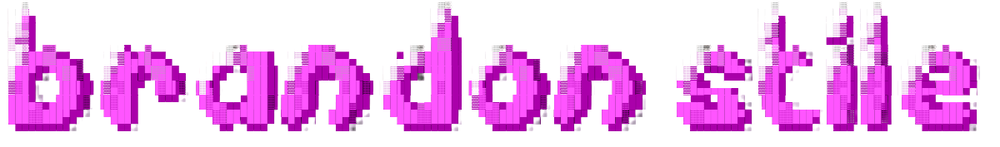

### Full stack software. Autonomous robots. Mixed reality.

Computer Science at **University of Central Florida**

---

I enjoy building software that bridges the gap between digital tools and the physical world, from robots that recognize and retrieve game objects to CAD assemblies inspected in extended reality.

## Pinned Repositories

  <a href="https://github.com/Daydream-Robotics/Robot-Core">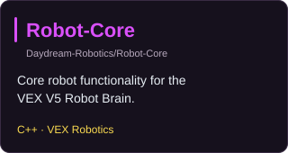</a>
  <a href="https://github.com/its-agn/DAVE">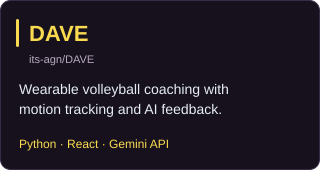</a>
  <a href="https://github.com/BAAA-Hacks/cad-vision">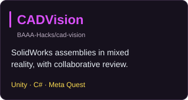</a>

## Toolbox

### Languages

  <a href="https://isocpp.org/">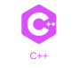</a>
  
  <a href="https://dotnet.microsoft.com/en-us/languages/csharp">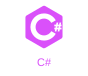</a>
  
  <a href="https://developer.mozilla.org/en-US/docs/Web/JavaScript">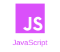</a>
  <a href="https://www.typescriptlang.org/">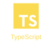</a>
  <a href="https://www.java.com/">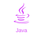</a>

### Robotics & Simulation

  
  
  <a href="https://github.com/NVIDIA/Dataset_Synthesizer">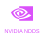</a>
  
  <a href="https://github.com/Unity-Technologies/com.unity.cloud.gltfast">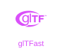</a>
  
  <a href="https://numpy.org/">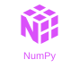</a>

### Web

  <a href="https://react.dev/">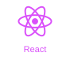</a>
  <a href="https://nextjs.org/">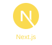</a>
  <a href="https://tailwindcss.com/">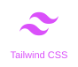</a>
  <a href="https://www.prisma.io/">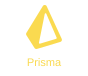</a>
  
  
  

### Development

  <a href="https://git-scm.com/">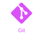</a>
  <a href="https://www.docker.com/">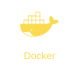</a>
  
  <a href="https://code.visualstudio.com/">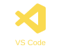</a>
  <a href="https://ai.google.dev/">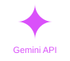</a>
  
  

## GitHub activity

  
  

## Let's connect

I'm interested in software engineering opportunities spanning full stack development, robotics, and interactive applications.

